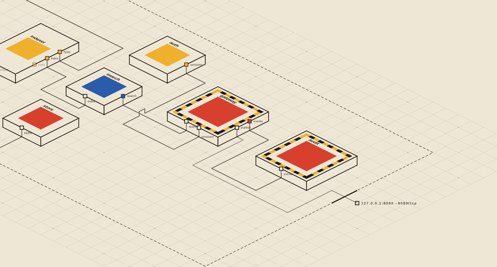

# DComp

DComp runs declarative, single-host systems of Docker components. A system
names component instances and links their typed input and output endpoints.

Version 0.2 routes every application interface through one small
`dcomp-proxy` process per running system. The proxy owns the Unix domain
sockets; components are clients that only call `connect()`. DComp bind-mounts
each container's own sockets individually and read-only, so a component cannot
see another component's endpoints or replace its mounted socket files.

DComp remains a short-lived CLI and Go library. The only long-lived host
process it creates is the per-system data-plane proxy. It is Docker-specific,
single-host, and intentionally has no cluster control plane.

## Description files

A `component.dcomp` declares an existing image and its locally named
interfaces. A `system.dcomp` creates instances and links every input to one
compatible output:

```text
# components/filter/component.dcomp
docker example/filter:1
input example.document.v1.Documents documents
output example.document.v1.Documents filtered

# system.dcomp
system document-system
component source components/source
component filter components/filter
link filter.documents source.documents
```

The nominal service identifier must match across a link, but DComp does not
inspect schemas or payloads. System files can additionally declare bounded
binds, persistent volumes, arguments, published non-DComp ports, and egress.
See the [CLI and description-file reference](docs/reference.md) for the exact
grammar, path rules, validation, and command behavior.

## Component contract

At runtime DComp injects one address per declared endpoint:

```text
DCOMP_IN_DOCUMENTS=unix:///run/dcomp/in/documents
DCOMP_OUT_FILTERED=unix:///run/dcomp/out/filtered
```

Environment names use the endpoint name in uppercase with `-` converted to
`_`. For every input and output, the component connects to the supplied Unix
socket and speaks its application protocol on the resulting stream.

Components must not bind or listen on these interface paths. The removed
0.1 contract—`DCOMP_LINK_*`, Docker DNS, and fixed port `50051`—is not
supported by 0.2 components.

The repository ships helpers for Go/gRPC, dependency-free
[Python](sdk/python/README.md), and dependency-free
[Node.js](sdk/node/README.md). All validate the same address contract and
connect as clients; none binds a DComp interface path. The language guides
describe their framework boundaries and shutdown/reconnection behavior.

Images must still declare a meaningful Docker `HEALTHCHECK`. The bundled
`dcomp-healthcheck --socket PATH` can verify that an orchestrator-owned socket
is mounted; applications may provide a stronger protocol-specific check.

See [Component contract](docs/component-contract.md) for the complete image,
filesystem, shutdown, and runtime-policy rules.

## Proxy data plane

The host runtime layout defaults to `/var/run/dcomp`:

```text
/var/run/dcomp/<system>/
├── proxy.json
├── proxy.pid
├── proxy.log
├── proxy.ready
├── proxy.sock
├── in/
│   └── <instance>.<input>
└── out/
    └── <instance>.<output>
```

Use `--runtime-root DIR` or `DCOMP_RUNTIME_ROOT` when another absolute host
path is required. This tree is transient and is distinct from durable state.

Inside a component, only its own endpoints are mounted:

```text
/run/dcomp/
├── in/documents
└── out/filtered
```

For each consumer connection, the proxy takes one connection from the linked
producer output pool and copies bytes in both directions. Fan-out uses
independent stream pairs rather than broadcasting or merging bytes, so
bidirectional protocols such as HTTP/2 and gRPC remain valid. Disconnected
components may reconnect without restarting the proxy.

The proxy creates every listener before reporting readiness. `dcomp up` waits
for that readiness before creating or starting component containers.

## Documentation

- [CLI and description-file reference](docs/reference.md)
- [Machine API 2](docs/machine-api.md)
- [System view and dashboard](docs/view.md)
- [Component contract](docs/component-contract.md)
- [Architecture](docs/architecture.md)
- [Lifecycle and recovery](docs/lifecycle.md)
- [Worked examples](examples/README.md)
- [Python component helpers](sdk/python/README.md)
- [Node.js component helpers](sdk/node/README.md)
- [Prior art](docs/prior-art.md)

## Build and install

Requirements are Go 1.25 or newer, Linux, and a local Docker Engine with API
1.44 or newer. The complete test suite additionally uses Python 3.10 or newer
and Node.js 20 or newer for the component SDKs.

```sh
make build
make test
sudo make install
```

Run only the Python and Node.js SDK tests with `make sdk-test`.

`make build` creates `bin/dcomp`, `bin/dcomp-proxy`, and
`bin/dcomp-healthcheck`. The proxy binary must be installed beside `dcomp`;
`DCOMP_PROXY_BINARY` may name an absolute development build instead.

Build the examples and run the Docker integration test with:

```sh
make examples
make integration
```

## CLI

The common workflow is deliberately small:

```sh
dcomp check system.dcomp
dcomp up system.dcomp
dcomp status document-system
dcomp view system.dcomp
dcomp dash
dcomp logs -f document-system
dcomp restart document-system filter
dcomp down document-system
```

Lifecycle operations are durable. If a command is interrupted, `resume`
continues its exact recorded operation and `abort` removes verified new
resources when safe. The [CLI and description-file reference](docs/reference.md)
covers every command, flag, exit status, environment override, and authored
directive. Automation should use [Machine API 2](docs/machine-api.md).

`dcomp view [--json] FILE|NAME` describes a system's components, declared
interfaces, links, and external routes. `dcomp dash` serves the same read-only
documents with a bundled topology viewer. See [System view](docs/view.md).



## State and identity

Durable state defaults to `$XDG_STATE_HOME/dcomp` or
`$HOME/.local/state/dcomp`; `--state-root` and `DCOMP_STATE_ROOT` override it.
The root is bound to one Docker Engine ID.

State records immutable container and network IDs plus the proxy instance ID,
PID, wiring digest, control socket, log path, and runtime directory. An
incomplete operation may also journal the exact endpoint identity that must be
removed after its container. Proxy shutdown verifies the control-socket
identity before signalling a recorded PID, avoiding unsafe PID-only process
control.

Changing only one image can retain unrelated containers and the existing
proxy. Changing endpoints or links replaces the proxy and component
containers, because individual Docker socket bind mounts retain the old socket
inode. Dynamic rewiring without component restart is deliberately outside the
0.2 scope.

## Migration from 0.1.x

0.2 is wire-incompatible with 0.1 components.

1. Run `dcomp down NAME` with the 0.1 binary before upgrading. Version 0.2
   rejects the old durable-state format instead of guessing ownership.
2. Remove component listeners on `0.0.0.0:50051`.
3. Replace `DCOMP_LINK_<INPUT>` reads with `DCOMP_IN_<INPUT>` and connect to
   the supplied Unix address.
4. Make each declared output connect to `DCOMP_OUT_<OUTPUT>` and serve its
   protocol on that connected stream. Go/gRPC components can use
   `component.WithOutput`.
5. Update health checks that assumed local TCP port `50051`.
6. Install `dcomp-proxy` beside the `dcomp` executable.

The `system.dcomp` and `component.dcomp` grammars themselves are unchanged.
Per-link Docker bridges and `DCOMP_LINK_*` are removed completely.

## Deliberate limits

DComp 0.2 provides no multi-host overlay, replicas, automatic failover,
encryption, dynamic rewiring, arbitrary Docker option passthrough, secret
store, image build/pull workflow, or long-lived control-plane daemon. Unix
socket permissions are the local trust boundary; optional peer-credential
policy can be added without changing the component address contract.

The project is licensed under the [MIT License](LICENSE).
